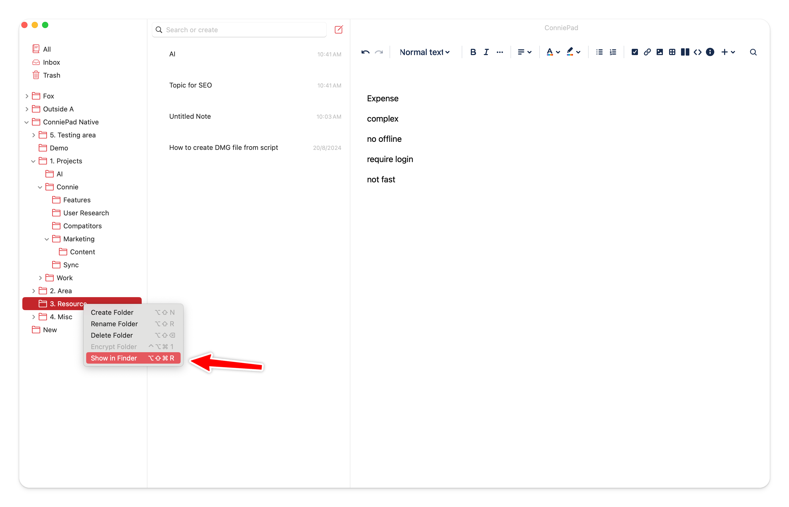

# How to backup

By default, your notes is stored in your iCloud folder, on your disk as files & folders. **Right-click on the folder and choose 'Show in finder'** will give you access to all your files.

Then you could backup these data by your own way i.e Git, Time Machine Dropbox, Google Drive, Hard drive.

