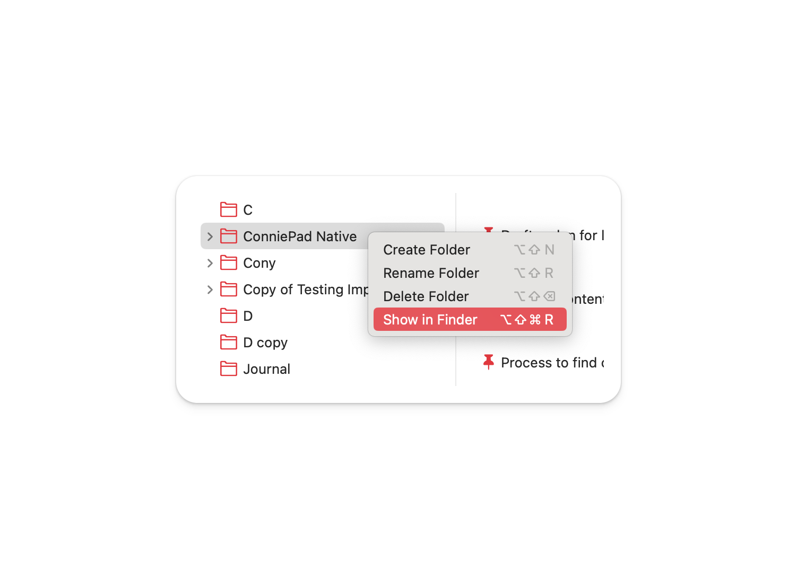
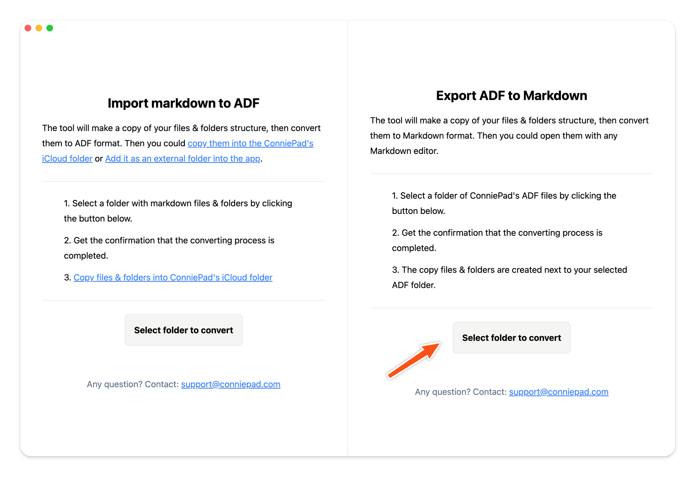

# Bulk export notes to markdown files

In order to bulk export notes to markdown files, there are 2 steps:

1. Copy the files & folders and folders in ConniePad to place you want to export.
2. Convert the copied files & folders to markdown format.

**Note: The convert tools will mirror your folder & subfolder structure**

## 1. Copy app data folder

Right click on the root folder of ConniePad, click `Show in Finder`, you will see the app data folder. Then just copy the files & folders to the location you want to export.

## 2. Convert markdown to ADF

Download convert tool here → [ConniePad-ConvertTool](https://pub-b595c7ba3a3c4eb9983fd25c27bd88ab.r2.dev/Trial/ConniePad-ConverterTool-darwin-arm64-1.0.1.zip).

The tool will make a copy of your files & folders structure, then convert the notes in ADF format to Markdown, which you can open with any text editor. After run the tool, you will get a folder named `Copy of [your folder name]` next to your selected folder.

Note that the 

