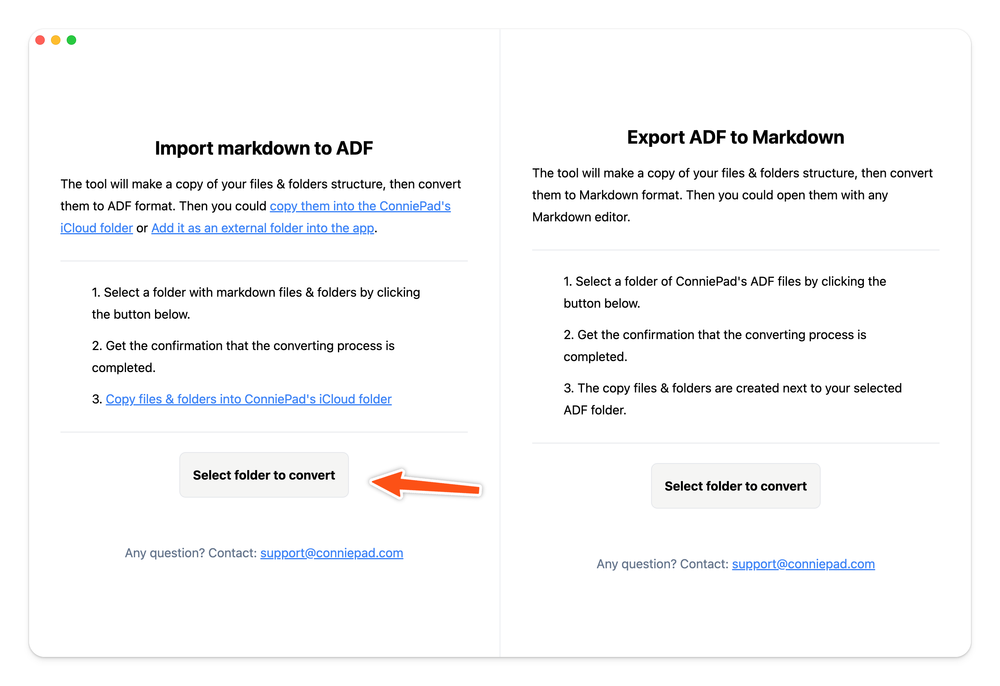
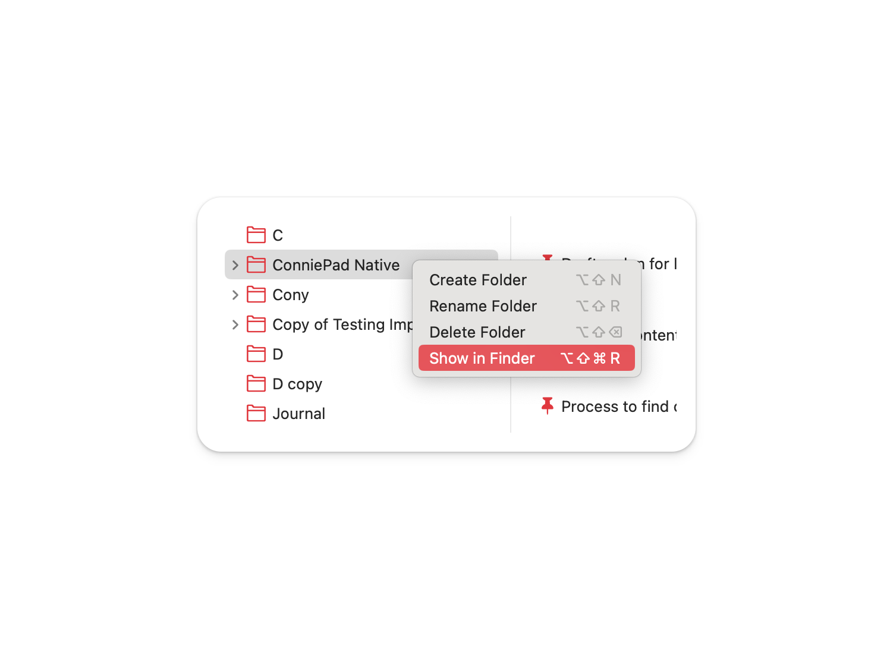

# Bulk import markdown to notes

In order to bulk import markdown files, there are 2 steps:

1. Convert all markdown files to ADF format.
2. Copy the converted files & folders to the app data folder.

**Note: The convert tools will mirror your folder & subfolder structure**

## 1. Convert markdown to ADF

Download convert tool here → [ConniePad-ConvertTool](https://pub-b595c7ba3a3c4eb9983fd25c27bd88ab.r2.dev/Trial/ConniePad-ConverterTool-darwin-arm64-1.0.1.zip).

The tool will make a copy of your markdown files & folders, then convert the markdown files to ADF format, which is a JSON format that ConniePad can understand. After run the tool, you will get a folder named `Copy of [your folder name]` next to your selected folder.

## 2. Copy to app data folder

Right click on the root folder of ConniePad, click `Show in Finder`, you will see the app data folder. Then just copy the converted files & folders to the app data folder.

Then just copy the converted files & folders to the app data folder.

