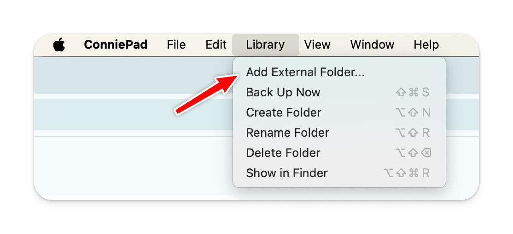

# External folder

By default, your notes is stored in your iCloud account. You can also store it on an external drive by link an external folder to the app.

Then you could sync & backup these external folders by your own way i.e Dropbox, Google Drive, Git.

## How to link external folders

In app menu, select **Libary > Add external folder**.

