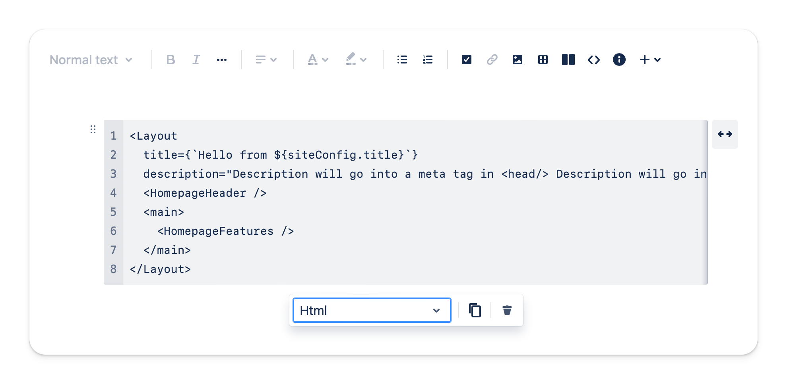

# Code block / Code snippet

Code blocks / Code snippets are useful for storing code that you want to share with others, or display it within the page.

1. Code block is horizontal scrollable that help you easily to read the long code.
2. Code highlighting is coming soon...

