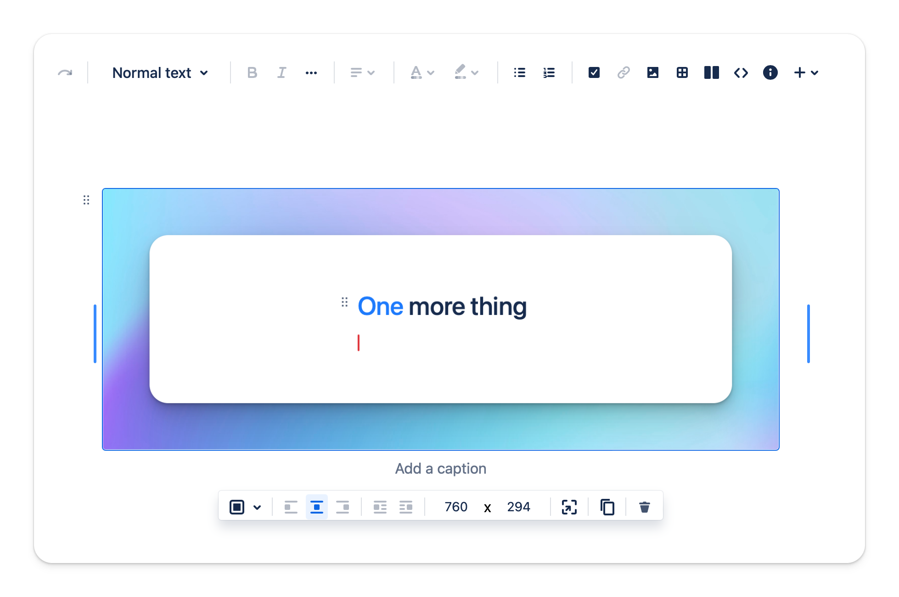
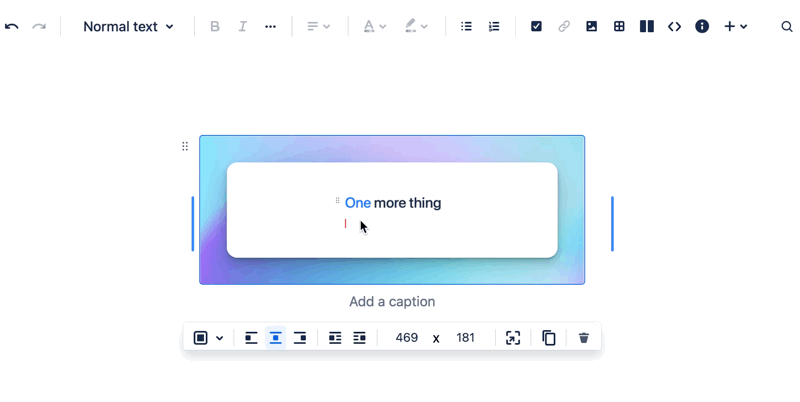

# Embed images / attachments

You can align the image to the left, center, or right, and wrap it with text, or resize it to any size.

---

## How to insert the image

You can insert a single image or multiple images.

### Via drag & drop

---

### Via toolbar

---

### Via quick Insert

---

## How to resize  the image

You can resize the image by dragging the resizing handle.

---

## What is supported files?

- JPG
- PNG
- GIF
- WebP
- HEIC (Apple Photos format)
