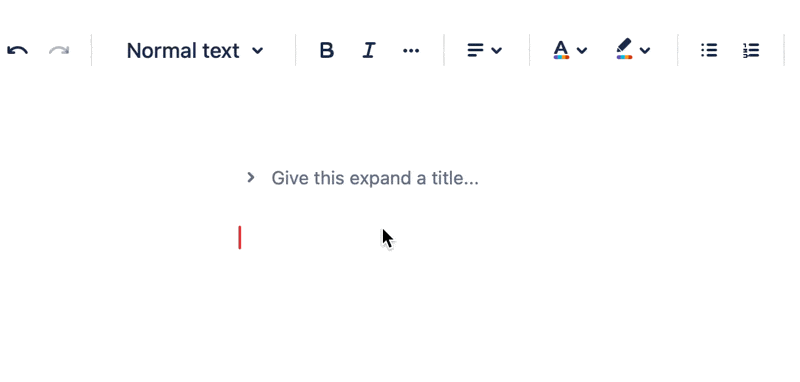

# Expand / Collapse Section

## What is Expand

Expand is a colapsable component that can be used to display additional information.

## How to insert expand

You could insert expand via [Toolbar](/docs/editor/toolbar), [Quick Insert menu](/docs/editor/quick-insert) or [Shortcut keys](/docs/editor/shortcut)