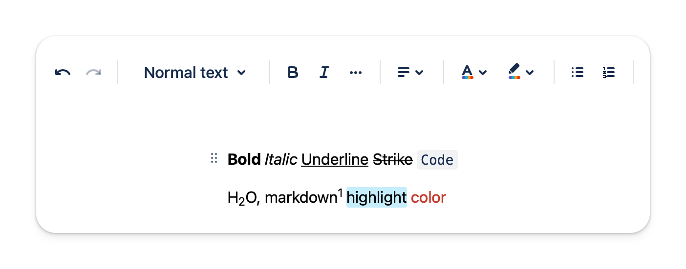
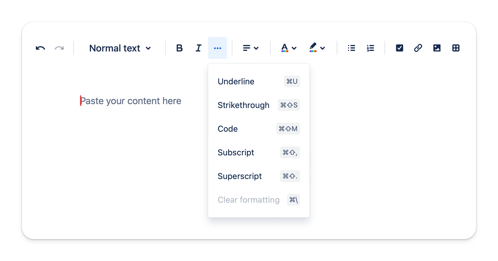
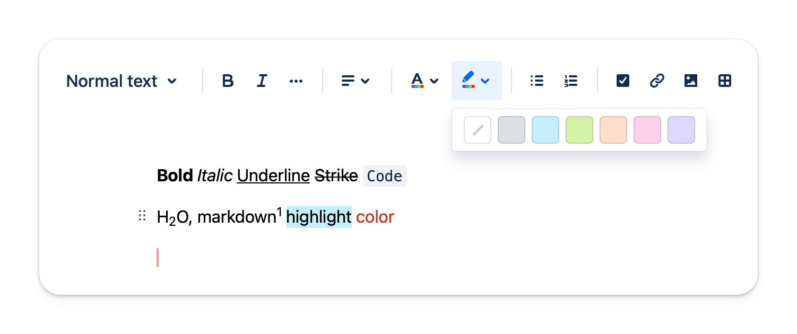
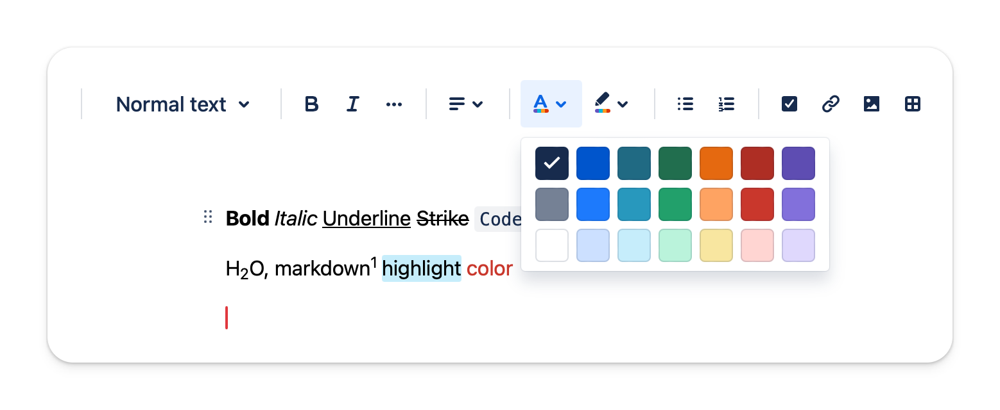

# Formatting Text

## Supported style

The editor supports various formatting options that allow you to express your ideas.

### Advanced

- Highlight
- Color
- Alignment
- Subscript
- Superscript

### Basic

- Bold
- Italic
- Underline
- Strikethrough
- Code
- Link

## How to use

You could click on the toolbar buttons or use the keyboard shortcut provided. You even could use [Markdown syntax](/docs/editor/markdown-syntax).

## Text highlighting

There are 6 colors to choose from when highlighting the text.

## Text color

There are 21 colors to choose from when styling the text.

## Text alignment

You could align the text **left, right or center**.

## Link

Link is auto detected and auto-formatting. You could click into the link to have more options to change its display text.
