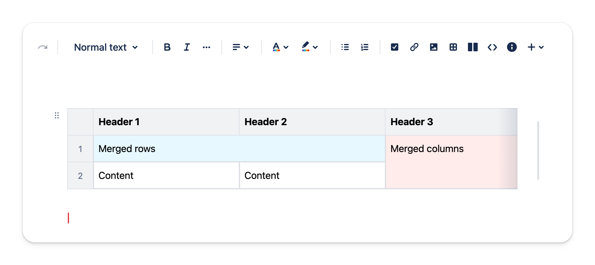
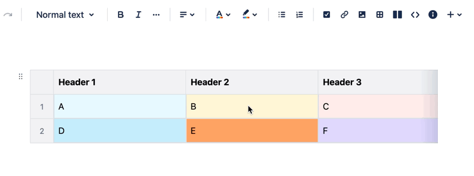
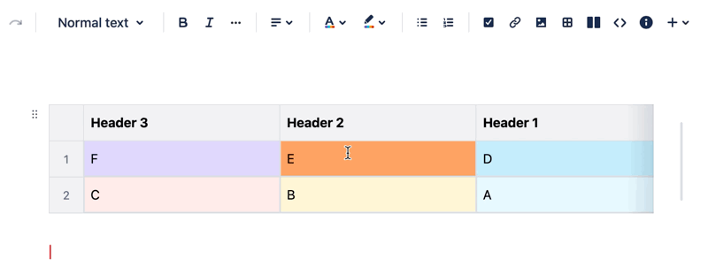

# Table

Table is a great way to express your idea in grid. The table in this app is much more powerful than markdown and other note app. There is ton of customisation for you to use, including:

- Merged rows
- Merged columns
- Background color
- Auto-increase row number

To let you work effectively with table, it also support:

- Drag & drop to reorder column and row
- Button to insert new row or column

## Merged rows & columns

Table support merging cells together .

## Background color

Set the background color of each cell in the table. 

## Drag and drop to reorder column and row

You can rearrange columns and rows by dragging and dropping them.

## Convenient button to insert new row or column

You can insert a new row or column by clicking the button located at the divider between table cells. 

