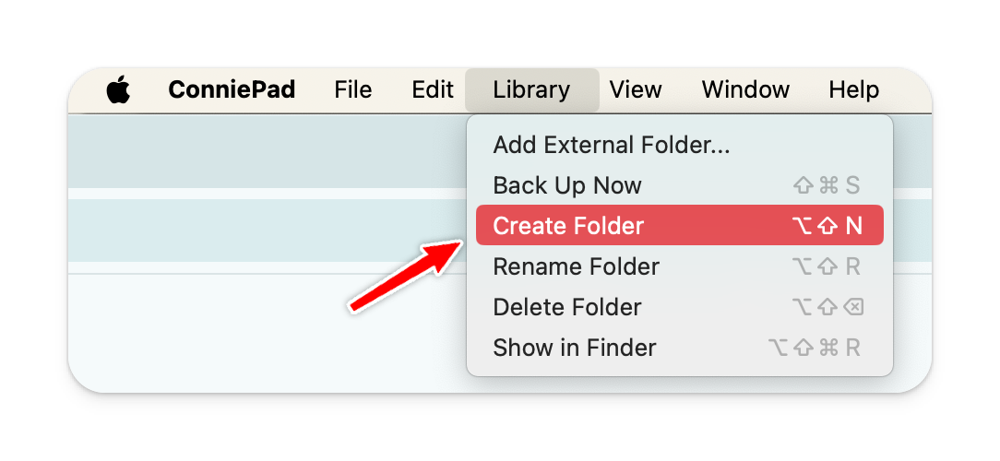

# Create your first note

## Create a folder

## Create a note

## Rename a note

Use shortcut `Cmd + R` to rename your current note

## Move a note

Right click on the note and select "Move"

## Pin a note

Use shortcut `Cmd + 8` to pin or unpin or right click on the note to select "Pin/Unpin" button from context menu

## Delete a note

Use shortcut `Cmd + Backspace` to delete your current note or right click to select "Delete" from button in context menu

## Search for a note

Type any text in the Search box to search for a title or keywords in the note.

## Duplicate a note

Use shortcut `Cmd + D` to duplicate your current note or right click to select "Duplicate" from button in context menu
