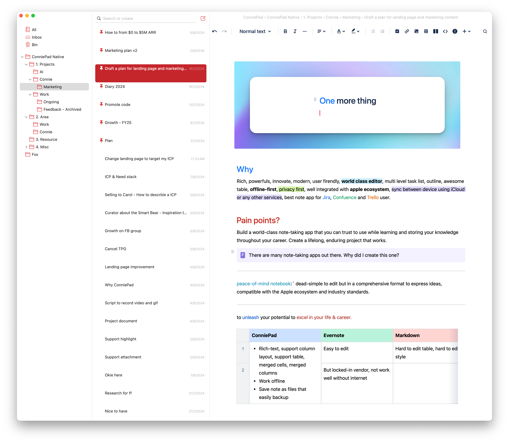

# Overview

## What is ConniePad?

ConniePad is a note taking app, that's modern, high-performance and easy to use on macOS & Apple platforms.

## Why ConniePad?

- Native on macOS -- High performance & high-efficiency compare with Electron app like Evernote, Notion, Obsidian
- Offline mode -- Work anywhere, anytime
- Easy to use -- Toolbar, Quick access menu and keyboard shortcuts
- Powerful note editor -- Support many rich text editing that other note taking & markdown text editor can't.
- Privacy -- Never access your note
- Compatible with Jira, Confluence, Trello formatting -- Best tool for enterprise
